# DOM - JavaScript

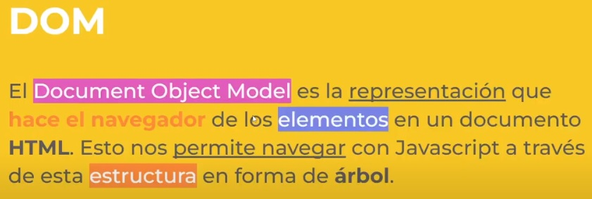

# Nodos

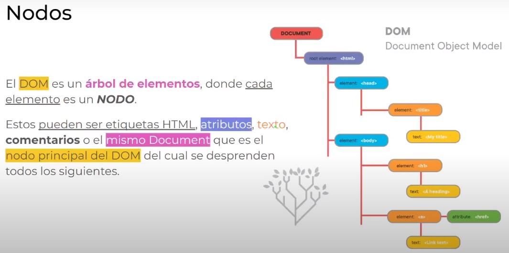

# Tipos de Nodos

Los nodos pueden ser:  

* **Document**, *nodo raíz* del que derivan todos los demás nodos del árbol.  
* **Element**, representa cada una de las *Etiquetas XHTML*. Se trata del único nodo que puede contener atributos y el único del que pueden derivar otros nodos.  
* **Attr**, se define un nodo de este tipo para representar cada uno de los *atributos de las etiquetas XHTML*, es decir, uno por cada par atributo=valor.  
* **Text**, nodo que contiene *el texto encerrado por una etiqueta XHTML*.  
* **Comment**, representa *los comentarios incluidos en la página XHTML*.  


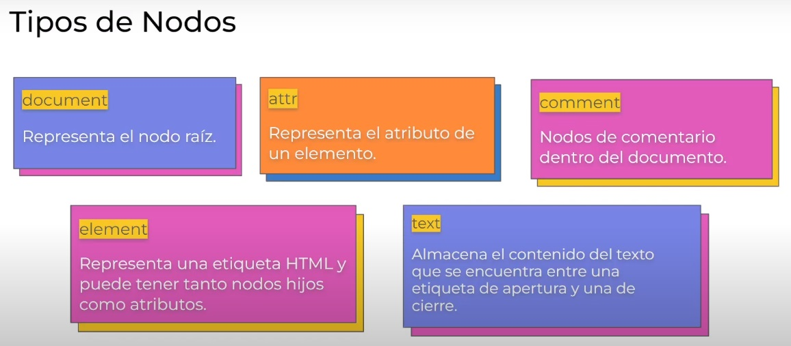  

# Representacion del DOM

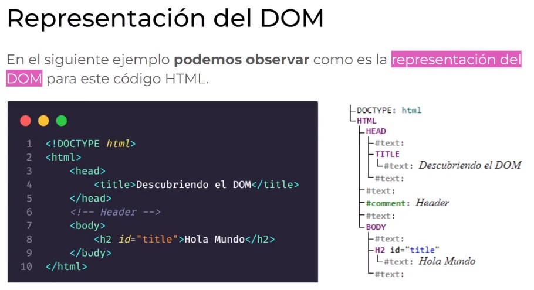

# Acceso al DOM

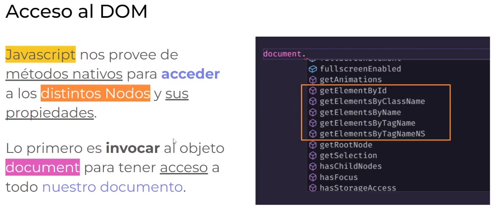

```
console.dir(document);
```
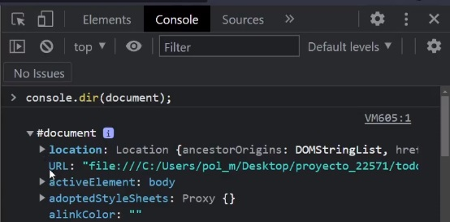

# Métodos de acceso al DOM

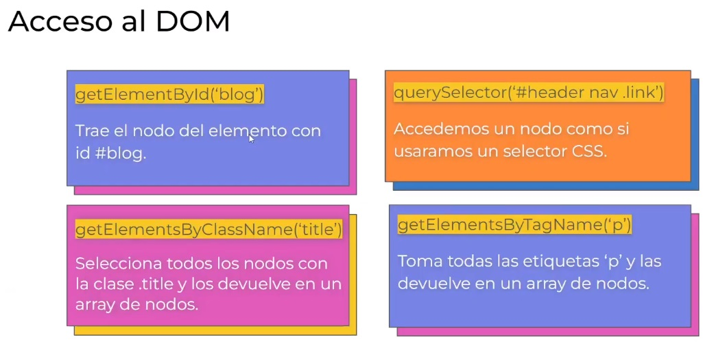

# .getElementById();
Retorna una referencia a un elemento por su único id.
```html
<h1 id='blog'>Título del Blog</h1>
<h1 id='blog-secundrio'>Título del Blog Secundario</h1>
```
```javascript
const blog = document.getElementById('blog');
    console.log(blog);
    console.log(blog.innerHTML);
    console.log(blog.innerText);
    console.log(blog.outerText);
    console.log(blog.textContent);
const blog = document.querySelector('#blog-secundario');
    console.log(blog);
    console.log(blog.innerHTML);
    console.log(blog.innerText);
    console.log(blog.outerText);
    console.log(blog.textContent);
```

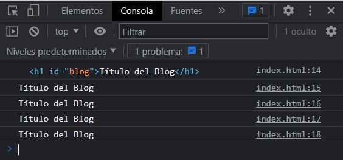

# .getElementsByClassName();
```html
<h1 class='blog'>Título del Blog</h1>
<p class="blog">Párrafo del Blog</p>
```
```javascript
const blog = document.getElementsByClassName('blog');
    console.log(blog);
    console.log(blog[0]);
    console.log(blog[1]);
    console.log(blog[0].innerHTML);
    console.log(blog[0].innerText);
    console.log(blog[1].outerText);
    console.log(blog[1].textContent);
const blog = document.querySelectorAll('.blog');
    console.log(blog);
    console.log(blog[0]);
    console.log(blog[1]);
    console.log(blog[0].innerHTML);
    console.log(blog[0].innerText);
    console.log(blog[1].outerText);
    console.log(blog[1].textContent);
```
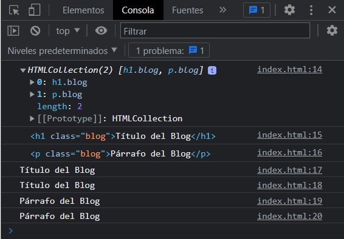

# .getElementsByName();
```html
<h1 class='blog' name='blog'>Título del Blog</h1>
<h1 class="blog-secundario" name="blog">Título del Blog Secundario</h1>
<h1 class="blog-numero" name="blog">123</h1>
<p class="blog-parrafo" name="blog">Párrafo del Blog</p>
    <script>
```
```javascript
const blog = document.getElementsByName('blog');
    console.log(blog);
    console.log(blog[0]);
    console.log(blog[1]);
    console.log(blog[2]);
    console.log(blog[0].innerHTML);
    console.log(blog[1].innerText);
    console.log(blog[2].outerText);
    console.log(blog[0].textContent);
const blog = document.querySelectorAll('body > h1');
    console.log(blog);
    console.log(blog[0]);
    console.log(blog[1]);
    console.log(blog[2]);
    console.log(blog[0].innerHTML);
    console.log(blog[0].innerText);
    console.log(blog[1].outerText);
    console.log(blog[1].textContent);
    console.log(blog[2].innerHTML);
    console.log(Number(blog[2].innerHTML));
```

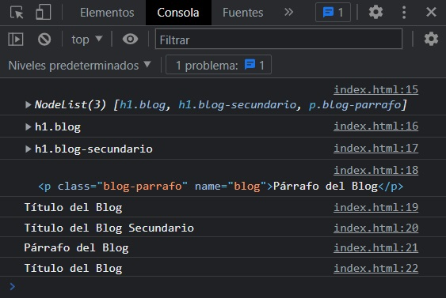
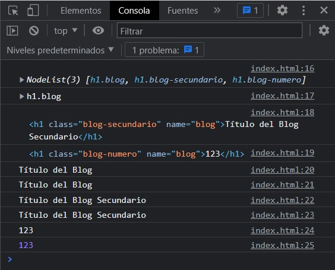

# .getElementsByTagName();
```html
<h1 class='blog'>Título del Blog</h1>
<h1 class='blog'>Título del Blog Secundario</h1>
<p class="blog">Párrafo del Blog</p>
```
```javascript
const blog = document.getElementsByTagName('h1')[0];
const blog2 = document.getElementsByTagName('h1')[1];
    console.log(blog);
    console.log(blog2);
    console.log(blog.innerHTML);
    console.log(blog2.innerText);
    console.log(blog.outerText);
    console.log(blog2.textContent);
const blog = document.querySelectorAll('h1')[0];
const blog2 = document.querySelectorAll('h1')[1];
    console.log(blog);
    console.log(blog2);
    console.log(blog.innerHTML);
    console.log(blog2.innerText);
    console.log(blog.outerText);
    console.log(blog2.textContent);
```

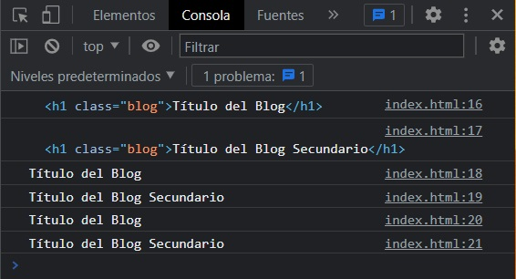

# HTML data-* Attributes
```html
<h1 class='blog' data-blog>Título del Blog</h1>
<h1 class='blog' data-blog>Título del Blog-Blog</h1>
<h1 class='blog' data-blog-secundario>Título del Blog Secundario</h1>
<p class="blog">Párrafo del Blog</p>
```
```javascript
const blog = document.querySelectorAll('[data-blog]');
    console.log(blog);
    console.log(blog[0]);
    console.log(blog[1]);
    console.log(blog[0].innerHTML);
    console.log(blog[0].innerText);
    console.log(blog[1].outerText);
    console.log(blog[1].textContent);
const blog = document.querySelector('[data-blog-secundario]');
    console.log(blog);
    console.log(blog.innerHTML);
    console.log(blog.innerText);
    console.log(blog.outerText);
    console.log(blog.textContent);
```
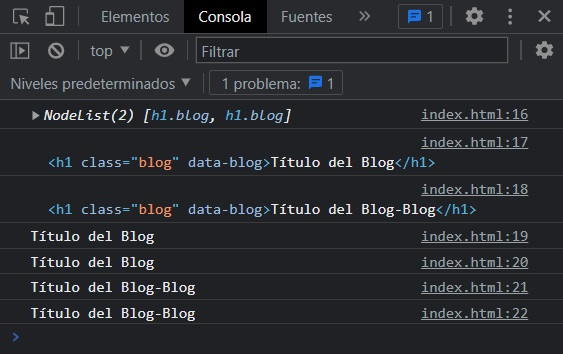

# La diferencia entre una HTMLCollection y una NodeList  

Una **NodeList** y una **HTMLCollection** son prácticamente lo mismo.

Ambos son colecciones tipo matriz (listas) de nodos (elementos) extraídos de un documento. Se puede acceder a los nodos por números de índice. El índice comienza en 0.

Ambos tienen una propiedad de longitud que devuelve el número de elementos de la lista (colección).

Una **HTMLCollection** es una colección de elementos de documento .

Una **NodeList** es una colección de nodos de documentos (nodos de elementos, nodos de atributos y nodos de texto).

Se puede acceder a los elementos de **HTMLCollection** por su nombre, identificación o número de índice.

Solo se puede acceder a los elementos de **NodeList** por su número de índice.

Una **HTMLCollection** es siempre una colección en vivo . Ejemplo: si agrega un elemento `<li>` a una lista en el DOM, la lista en **HTMLCollection** también cambiará.

Una **NodeList** suele ser una colección estática . Ejemplo: si agrega un elemento `<li>` a una lista en el DOM, la lista en **NodeList** no cambiará.

Los métodos `getElementsByClassName()` y `getElementsByTagName()` devuelven una **HTMLCollection** activa.

El método `querySelectorAll()` devuelve una lista de nodos estática.

La propiedad `childNodes` devuelve una lista de nodos activa.  

# Modificar el DOM  
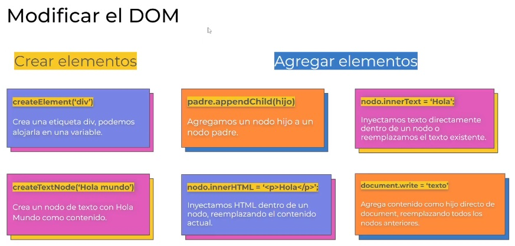
# Crear elementos del DOM
## createElement();
* Estoy creando un **Nodo-Hijo** en el DOM.  
* En este caso un `<p>`.  
* A continuación le doy un valor `'Esto es un <i>párrafo</i>'` 
* Puedo también pasarle un atributo por medio de `setAttribute()`, aquí una `class`. 
* Luego tengo que agregarlo al DOM por medio del **Nodo-Padre** utilizando `appendChild()` para que se represente en el HTML.
```html
<header>
    <h1>My Website</h1>
</header>
```
```javascript
const header = document.querySelector('header');
const titulo = document.querySelector('h1');
    console.log(header);
    console.log(titulo);
const parrafo = document.createElement('p');
const link = document.createElement('a');
    console.log(parrafo);
    console.log(link);
parrafo.innerHTML = 'Esto es un <i>parrafo</i>';
link.innerText = 'Ir a google';
    console.log(parrafo.innerText);
    console.log(link.innerText);
parrafo.setAttribute('class', 'parrafo');
titulo.style.color = 'blue';
link.setAttribute('href', 'https://www.google.com');
    console.log(parrafo);
    console.log(link);
header.appendChild(parrafo);
header.appendChild(link);
    console.log(header);
```
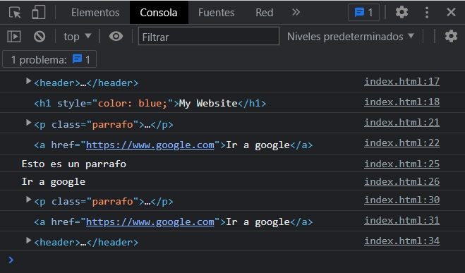
## createTextNode();
# Agregar elementos al DOM
## `nodo.innerText = 'Nuevo Titulo'`
Inyectamos **texto** directamente dentro de un nodo en caso de que este vacío o reemplazamos el texto existente.
```html
<h1 class='blog' name='blog'>Título del Blog</h1>
```
```javascript
const blog = document.querySelectorAll('.blog');
    console.log(blog);
    console.log(blog[0].innerText);
const blogNuevo = blog[0].innerText = 'Nuevo Título';
    console.log(blogNuevo);
```
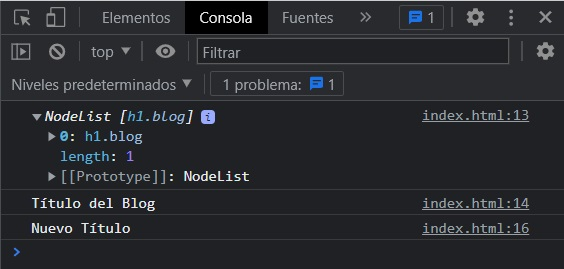

# Eventos del DOM
Se ejecutan en el navegador a partir de la acción de los usuarios.  

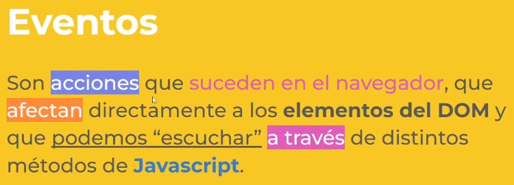  

# Manejadores de Eventos

El **manejador de eventos** es una función que se ejecuta cuando se produce un evento.  

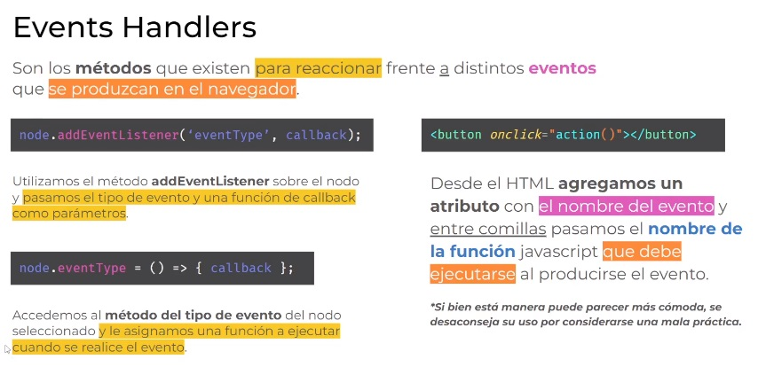 

```html
<section>
    <button type="button">Acción</button>
</section>
```
El `<button type='submit'></button>` recarga la página.  
El `<button type='button></button>'` NO recarga la página.  
Hay 3 formas de agregar un manejador de eventos:
* Atributo HTML / No se aconseja
    ```html
    <button type='button' onclick='alert("Hola Mundo")'>Enviar</button>
    ```
* Propiedad DOM
    ```javascript
    node.eventType = () => { callback };
    ```
    
    ```javascript
    const boton = document.querySelector('button');
    boton.onclick = function() {
        alert('Hola Mundo');
    }
    ```
* addEventListener() / De buena práctica
    ```javascript
    node.addEventListener = ('eventType', callback);
    ```
    ```javascript
    const boton = document.querySelector('button');
    boton.addEventListener('click', function() {
        alert('Hola Mundo');
    });
    ```
    Ejemplo 1:
    ```html
    <section>
        <button id="btn" type="button">Acción</button>
    </section>
    ```
    ```javascript
    const btn = document.getElementById('btn');

    btn.addEventListener('click', (event) => {
        // console.log('Funciona el click');
        // alert('Funciona el click');
        const section = document.querySelector('section'); // Padre
        const subtitle = document.createElement('div'); // Hijo
        subtitle.innerHTML = '<p>Esto es un subtítulo</p>'
        subtitle.setAttribute('class', 'btn');
        section.appendChild(subtitle);
    });
    ```
    Ejemplo 2: Para algunos elementos, incluyendo `<input type="text">`, el evento change no se lanza hasta que el campo pierde el foco. Prueba a introducir algo en el campo, y luego pulsa en algún otro lugar para lanzar el evento.
    ```html
    <form action="">
        <input id="search" type="text">
    </form>
    ```
    ```javascript
    const search = document.getElementById('search');

    search.addEventListener('change', (event) => {
        console.log(event.target.value)
    });
    ```
    Ejemplo 3: El primer parametro que recibe es el evento, despues puedo pasar mas parametros y usarlos
    ```html
    <header>
        <h1>My Website</h1>
    </header>
    <main>
        <section>
            <form action="">
                <input id="search" type="text">
            </form>
        </section>
    </main>
    ```
    ```javascript
    const search = document.getElementById('search');
    const header = document.querySelector('header h1');
        
    search.addEventListener('keyup', (e, parametro) => {
        header.innerText = e.target.value;
    });
    ```
# Tipos de Eventos  

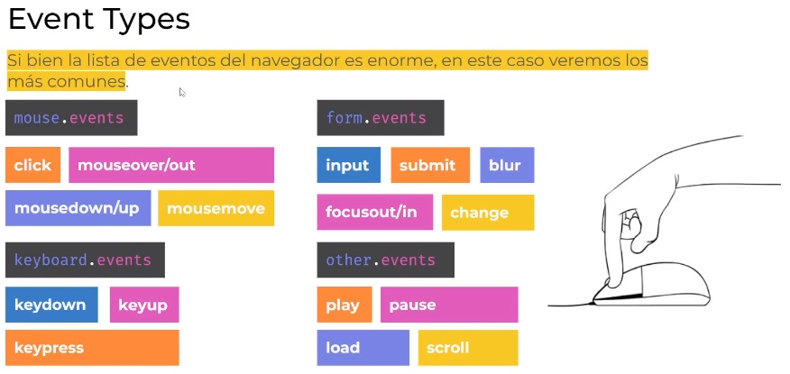